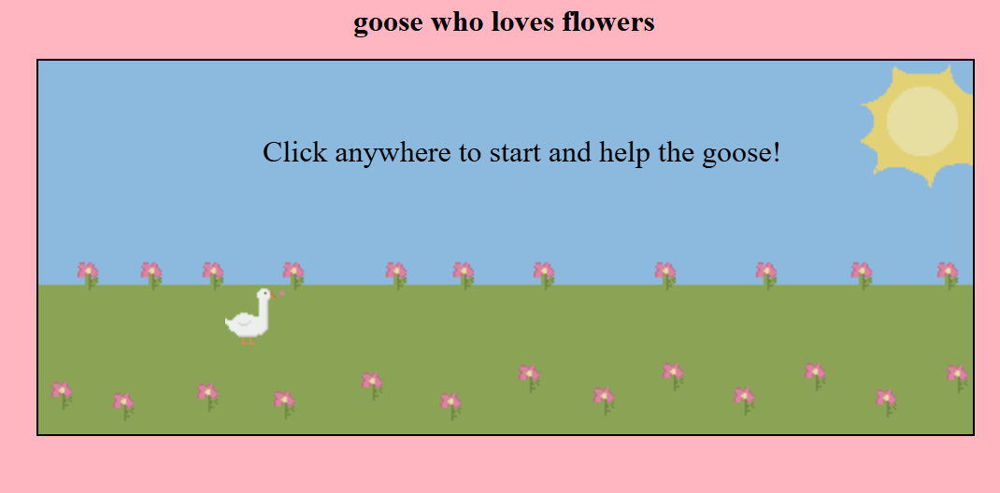
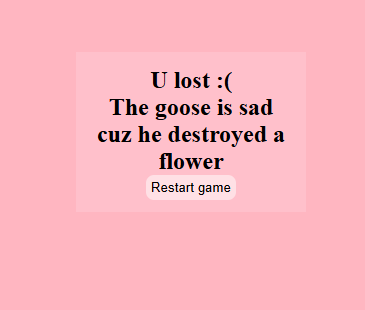
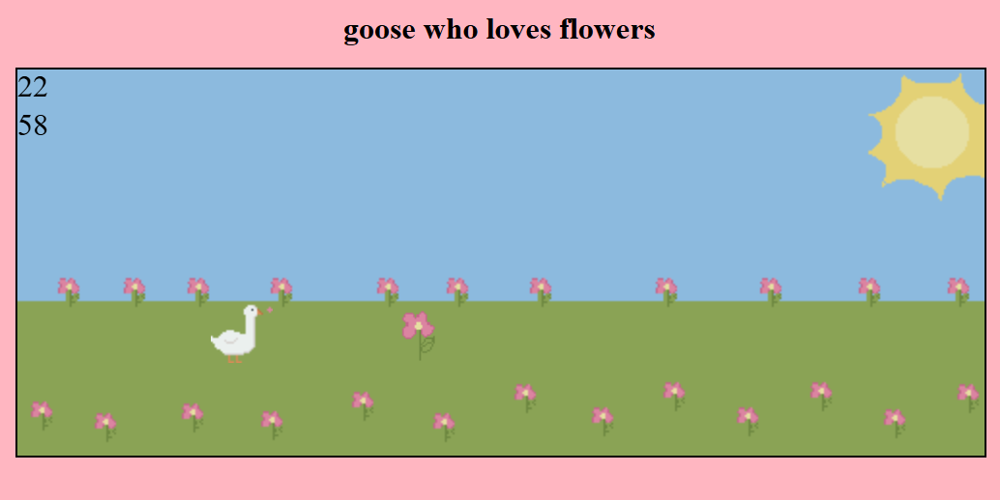

# first-JS-game
it's my first game made with JS, HTML and CSS  
it was inspired by the google's dino game, but more simple and (tried to be) cuter  

the main idea of the game is to help a goose who loves flowers to avoing stepping on one of them, so when you touch the flower, you lose :(

## Use instructions
clicking anywhere of the screen, the duck will jump  
so the player need to help the goose avoid stepping on the flower  
if the goose touches the flower, this screen will be showed  

 
there will be a stopwatch and your best score  

## AI use
I used for debugging and for learn some JS concepts :D